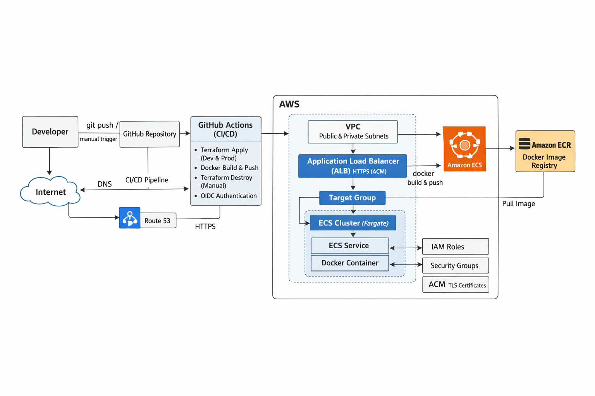

# Threat Composer Project

## Table of Contents
- [Project Overview](#project-overview)
- [Architecture](#architecture)
- [Folder Structure](#folder-structure)
- [Infrastructure](#infrastructure)
- [Application](#application)
- [Deployment](#deployment)
- [Testing](#running-locally)
- [Help](#Help)
- [Notes](#Notes)
- [Authors](#Authors)
- [Version history](#Version-history)
- [Acknowledgments](#Acknowledgments)

## Project Overview

This project deploys Threat Composer, a containerized application, on AWS ECS Fargate using Terraform.

Key features:

* Containerized deployment using Docker

* ECS Fargate for serverless container execution

* Public-facing Application Load Balancer (ALB) routing to ECS tasks

* Infrastructure as code with reusable Terraform modules

* CI/CD pipeline with GitHub Actions for automated builds and pushes

* AWS infrastructure includes VPC, NAT Gateway, ALB, ECS, ECR, IAM roles, Security Groups

## Architecture

Here’s the overview of the project infrastructure:




## High-Level Architecture & Traffic Flow

- **GitHub Actions (CI/CD)**  
  Automates Terraform infrastructure provisioning (Dev & Prod) and Docker image build/push using OIDC authentication.

- **Application Load Balancer (ALB)**  
  Public-facing load balancer routing incoming traffic to ECS services.

- **ECS (Fargate)**  
  Runs containerized `threat-composer` application tasks in private subnets.

- **NAT Gateway**  
  Provides outbound internet access for ECS tasks in private subnets.

- **Amazon ECR**  
  Stores Docker images built and pushed by CI/CD pipelines.

- **Terraf**


## Folder Structure

```bash
.github/
└── workflows/
    ├── docker-ci-dev.yml
    ├── docker-ci-prod.yml
    ├── terraform-ci-dev.yml
    ├── terraform-ci-dev-destroy.yml
    ├── terraform-ci-prod.yml
    └── terraform-ci-prod-destroy.yml

app/
├── backend/
│   ├── lib/
│   │   └── index.js
│   ├── node_modules/
│   ├── package-lock.json
│   └── package.json
├── threat-composer/
│   └── [all app code copied from original repo]

docker/
├── .dockerignore
├── docker-compose.yaml
└── Dockerfile

infra/
└── terraform/
    ├── envs/
    │   ├── dev/
    │   │   ├── backend.tf
    │   │   ├── main.tf
    │   │   ├── variables.tf
    │   │   ├── outputs.tf
    │   │   ├── provider.tf
    │   │   └── terraform.tfvars
    │   └── prod/
    │       ├── backend.tf
    │       ├── main.tf
    │       ├── variables.tf
    │       ├── outputs.tf
    │       ├── provider.tf
    │       └── terraform.tfvars
    └── modules/
        ├── acm/
        │   ├── main.tf
        │   ├── variables.tf
        │   └── outputs.tf
        ├── alb/
        │   └── submodules/
        │       ├── listener/
        │       │   ├── main.tf
        │       │   ├── variables.tf
        │       │   └── outputs.tf
        │       └── target_group/
        │           ├── main.tf
        │           ├── variables.tf
        │           └── outputs.tf
        ├── ecr/
        │   ├── main.tf
        │   ├── variables.tf
        │   └── outputs.tf
        ├── ecs/
        │   └── submodules/
        │       ├── service/
        │       │   ├── main.tf
        │       │   ├── variables.tf
        │       │   └── outputs.tf
        │       └── task_definition/
        │           ├── main.tf
        │           ├── variables.tf
        │           └── outputs.tf
        ├── iam/
        │   └── submodules/
        │       ├── alb_role/
        │       │   ├── main.tf
        │       │   ├── variables.tf
        │       │   └── outputs.tf
        │       ├── ecs_execution_role/
        │       │   ├── main.tf
        │       │   ├── variables.tf
        │       │   └── outputs.tf
        │       └── ecs_task_role/
        │           ├── main.tf
        │           ├── variables.tf
        │           └── outputs.tf
        ├── route53/
        │   ├── main.tf
        │   ├── variables.tf
        │   └── outputs.tf
        ├── security_groups/
        │   ├── main.tf
        │   ├── variables.tf
        │   └── outputs.tf
        └── vpc/
            └── submodules/
                ├── internet_gateway/
                │   ├── main.tf
                │   ├── variables.tf
                │   └── outputs.tf
                ├── nat_gateway/
                │   ├── main.tf
                │   ├── variables.tf
                │   └── outputs.tf
                ├── private_subnet/
                │   ├── main.tf
                │   ├── variables.tf
                │   └── outputs.tf
                ├── public_subnet/
                │   ├── main.tf
                │   ├── variables.tf
                │   └── outputs.tf
                └── route_tables/
                    ├── main.tf
                    ├── variables.tf
                    └── outputs.tf

.envs
.gitignore
.gitmodules
README.md
screenshots/
```` 


## Infrastructure

### Terraform Modules

- **ACM**: Optional SSL/TLS certificate management for HTTPS traffic (currently commented out)
- **ALB**: Application Load Balancer with listeners and target groups to route traffic to ECS tasks
- **ECR**: Docker image repository for storing application images
- **ECS**: Cluster with services and task definitions running the containerized application
- **IAM**: Roles for ECS tasks and ALB to control access and permissions
- **Route 53**: Optional DNS records pointing a domain/subdomain to the ALB (currently commented out)
- **Security Groups**: Network access management for ALB and ECS tasks
- **VPC**: Public and private subnets, NAT Gateway, Internet Gateway, and route tables for secure networking

- All infrastructure is implemented using **modular, reusable Terraform modules** for maintainability and environment separation.


## Application

- **Dockerfile / docker-compose.yaml**: Defines how the Node.js application container is built and run locally
- **app/threat-composer/**: Main application code
- **app/backend/**: Backend logic with Node.js dependencies

Docker images are built and pushed to Amazon ECR via GitHub Actions and tagged per environment (`dev-latest`, `prod-latest`).


## Deployment

### CI/CD Pipeline

#### Docker CI Workflows (`docker-ci-dev.yml` / `docker-ci-prod.yml`)

1. Checks out code from the repository
2. Lints the Dockerfile
3. Builds Docker images
4. Pushes images to Amazon ECR
5. Updates the ECS service with the new image

#### Terraform CD Workflows (`terraform-ci-dev.yml` / `terraform-ci-prod.yml`)

1. Runs Terraform init, plan, and apply
2. Provisions or updates AWS infrastructure
3. Deploys ECS services using AWS Fargate
4. Supports zero-downtime updates via ECS rolling deployments

#### Manual Terraform Destroy

- `terraform-ci-dev-destroy.yml`
- `terraform-ci-prod-destroy.yml`

Destroy workflows are **manually triggered** to safely tear down environments.


### Manual Terraform Commands

```bash
cd infra/terraform/envs/dev   # or prod
terraform init
terraform plan
terraform apply -auto-approve
```` 
### Running Locally

#### 1. Build the Docker image

```bash
docker build -t threat-composer-local:latest -f docker/Dockerfile .
````

#### 2. Run Container

```bash
docker run -d -p 8080:80 threat-composer-local:latest
```` 

#### 3. Test Locally

```bash
curl http://localhost:8080/health
````

#### You should see:

{"status":"UP"}


## Help

- If port `8080` is already in use when running the container locally:

```bash
lsof -i :8080
kill <PID>
````


## Notes

- Terraform uses a remote S3 backend with DynamoDB state locking
- Ensure the Terraform remote state bucket exists before running workflows
- ACM and Route53 modules are optional and can be commented out if no domain is configured


## Authors

* Ramzan [www.linkedin.com/in/ramzan-k]

* GitHub: https://github.com/Ramzan9000


## Version History

* 0.2 – Added ECS service, ALB, IAM roles, ECR repository

* 0.1 – Initial Terraform and Docker setup


## Acknowledgments

* AWS Documentation for ECS, ECR, ALB

* Terraform AWS Provider Docs

* Docker Official Documentation

* Inspiration from containerized application deployment best practices


